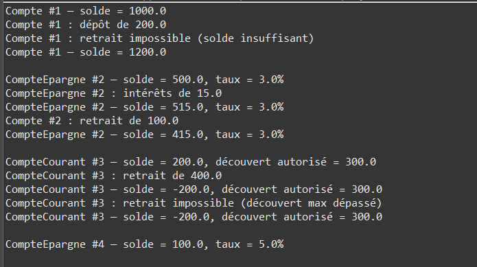

# Exercise 1: Bank Account Hierarchy



## Objective
Implement inheritance in Java through a bank account hierarchy: base account with two specialized types (CompteEpargne and CompteCourant).

## Key Concepts
- Inheritance with `extends`
- Method overriding
- `protected` access for subclasses
- Static counter for unique IDs
- `super()` constructor calls

## Implementation

### Compte (Base Class)
```java
package com.example.tp;

public class Compte {
    private static int compteur = 0;
    private final int numero;
    protected double solde;

    public Compte(double soldeInitial) {
        this.numero = ++compteur;
        this.solde = soldeInitial;
    }

    public void deposer(double montant) {
        solde += montant;
    }

    public void retirer(double montant) {
        if (montant <= solde) {
            solde -= montant;
        }
    }

    public void afficherDetails() {
        System.out.printf("Compte #%d - Solde: %.2f€%n", numero, solde);
    }
}
```

### CompteEpargne (Savings Account)
```java
public class CompteEpargne extends Compte {
    private double tauxInteret;

    public CompteEpargne(double soldeInitial, double tauxInteret) {
        super(soldeInitial);
        this.tauxInteret = tauxInteret;
    }

    public void appliquerInterets() {
        solde += solde * tauxInteret;
    }

    @Override
    public void afficherDetails() {
        System.out.printf("Compte Épargne - Solde: %.2f€, Taux: %.2f%%%n",
                          solde, tauxInteret * 100);
    }
}
```

### CompteCourant (Checking Account)
```java
public class CompteCourant extends Compte {
    private double decouvertAutorise;

    public CompteCourant(double soldeInitial, double decouvertAutorise) {
        super(soldeInitial);
        this.decouvertAutorise = decouvertAutorise;
    }

    @Override
    public void retirer(double montant) {
        if (montant <= solde + decouvertAutorise) {
            solde -= montant;
        }
    }

    @Override
    public void afficherDetails() {
        System.out.printf("Compte Courant - Solde: %.2f€, Découvert: %.2f€%n",
                          solde, decouvertAutorise);
    }
}
```

## Usage Example
```java
public class Main {
    public static void main(String[] args) {
        CompteEpargne epargne = new CompteEpargne(1000, 0.03);
        epargne.deposer(500);
        epargne.appliquerInterets();
        epargne.afficherDetails();

        CompteCourant courant = new CompteCourant(500, 200);
        courant.retirer(600);  // Uses overdraft
        courant.afficherDetails();
    }
}
```

## Expected Output
```
Compte Épargne - Solde: 1545.00€, Taux: 3.00%
Compte Courant - Solde: -100.00€, Découvert: 200.00€
```

## Compilation & Execution
```bash
cd src
javac com/example/tp/*.java
java com.example.tp.Main
```

## Extensions
- Add transaction history
- Implement transfer between accounts
- Add monthly fees
- Create `ComptePremium` with benefits
