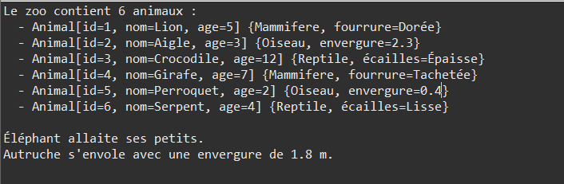

# Exercise 2: Zoo Management with Dynamic Array



## Objective
Design a Java zoo system with inheritance (Animal → Mammifere/Oiseau/Reptile) and dynamic array management that automatically expands.

## Key Concepts
- Multi-type inheritance (3 animal types)
- Dynamic array doubling when full
- Polymorphic collections
- Type casting for specific behaviors
- Protected members for subclass access

## Implementation

### Animal (Base Class)
```java
package com.example.tp;

public class Animal {
    private static int compteur = 0;
    private final int id;
    protected String nom;
    protected int age;

    public Animal(String nom, int age) {
        this.id = ++compteur;
        this.nom = nom;
        this.age = age;
    }

    public void seDeplacer() {
        System.out.println(nom + " se déplace.");
    }

    public String toString() {
        return "Animal[id=" + id + ", nom=" + nom + ", age=" + age + "]";
    }
}
```

### Mammifere (Mammal)
```java
public class Mammifere extends Animal {
    private String couleurFourrure;

    public Mammifere(String nom, int age, String couleurFourrure) {
        super(nom, age);
        this.couleurFourrure = couleurFourrure;
    }

    public void allaiter() {
        System.out.println(nom + " allaite ses petits.");
    }

    @Override
    public String toString() {
        return super.toString() + " {Mammifere, fourrure=" + couleurFourrure + "}";
    }
}
```

### Oiseau (Bird)
```java
public class Oiseau extends Animal {
    private double envergure;

    public Oiseau(String nom, int age, double envergure) {
        super(nom, age);
        this.envergure = envergure;
    }

    public void voler() {
        System.out.println(nom + " s'envole avec une envergure de " + envergure + " m.");
    }

    @Override
    public String toString() {
        return super.toString() + " {Oiseau, envergure=" + envergure + "}";
    }
}
```

### Reptile
```java
public class Reptile extends Animal {
    private String typeEcailles;

    public Reptile(String nom, int age, String typeEcailles) {
        super(nom, age);
        this.typeEcailles = typeEcailles;
    }

    public void seChauffer() {
        System.out.println(nom + " se chauffe au soleil.");
    }

    @Override
    public String toString() {
        return super.toString() + " {Reptile, écailles=" + typeEcailles + "}";
    }
}
```

### Zoo (Dynamic Container)
```java
public class Zoo {
    private Animal[] animaux = new Animal[5];
    private int nbAnimaux = 0;

    public void ajouterAnimal(Animal a) {
        if (nbAnimaux == animaux.length) {
            Animal[] tmp = new Animal[animaux.length * 2];
            System.arraycopy(animaux, 0, tmp, 0, animaux.length);
            animaux = tmp;
        }
        animaux[nbAnimaux++] = a;
    }

    public void afficherTous() {
        System.out.println("Le zoo contient " + nbAnimaux + " animaux :");
        for (int i = 0; i < nbAnimaux; i++) {
            System.out.println("  - " + animaux[i]);
        }
    }
}
```

## Usage Example
```java
public class Main {
    public static void main(String[] args) {
        Zoo monZoo = new Zoo();

        monZoo.ajouterAnimal(new Mammifere("Lion", 5, "Dorée"));
        monZoo.ajouterAnimal(new Oiseau("Aigle", 3, 2.3));
        monZoo.ajouterAnimal(new Reptile("Crocodile", 12, "Épaisse"));
        monZoo.ajouterAnimal(new Mammifere("Girafe", 7, "Tachetée"));
        monZoo.ajouterAnimal(new Oiseau("Perroquet", 2, 0.4));
        monZoo.ajouterAnimal(new Reptile("Serpent", 4, "Lisse"));

        monZoo.afficherTous();

        // Specific behaviors with casting
        Animal a1 = new Mammifere("Éléphant", 10, "Grise");
        monZoo.ajouterAnimal(a1);
        ((Mammifere)a1).allaiter();
    }
}
```

## Expected Output
```
Le zoo contient 6 animaux :
  - Animal[id=1, nom=Lion, age=5] {Mammifere, fourrure=Dorée}
  - Animal[id=2, nom=Aigle, age=3] {Oiseau, envergure=2.3}
  - Animal[id=3, nom=Crocodile, age=12] {Reptile, écailles=Épaisse}
  - Animal[id=4, nom=Girafe, age=7] {Mammifere, fourrure=Tachetée}
  - Animal[id=5, nom=Perroquet, age=2] {Oiseau, envergure=0.4}
  - Animal[id=6, nom=Serpent, age=4] {Reptile, écailles=Lisse}

Éléphant allaite ses petits.
```

## Compilation & Execution
```bash
cd src
javac com/example/tp/*.java
java com.example.tp.Main
```

## Dynamic Array Mechanism
When array is full (`nbAnimaux == animaux.length`):
1. Create new array with double capacity
2. Copy existing elements using `System.arraycopy()`
3. Replace old array with expanded one
4. Add new animal

## Extensions
- Add `Poisson` (Fish) and `Amphibien` classes
- Remove animal by ID
- Search animals by name
- Sort animals by age
- Track animal health and feeding schedules
