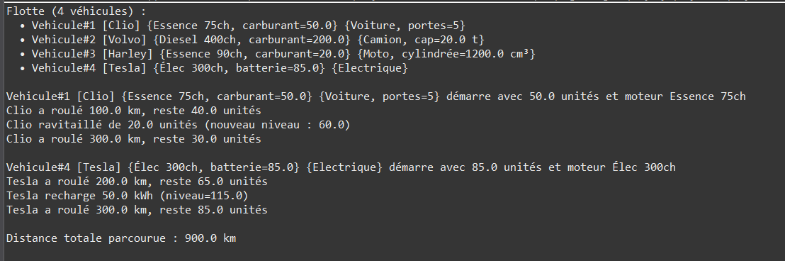

# Exercise 3: Vehicle Fleet Management - Inheritance and Composition



## Objective
Model a vehicle fleet with multi-level inheritance (Vehicule → Motorise → specific types), composition (Moteur class), fuel management, and fleet statistics.

## Key Concepts
- Multi-level inheritance (3 levels)
- Composition (HAS-A relationship)
- Fuel consumption logic
- Polymorphic fleet storage
- Method overriding for electric vehicles

## Implementation

### Moteur (Engine - Composition)
```java
package com.example.tp;

public class Moteur {
    private String type;
    private int puissance;

    public Moteur(String type, int puissance) {
        this.type = type;
        this.puissance = puissance;
    }

    public String toString() {
        return type + " " + puissance + "ch";
    }
}
```

### Vehicule (Base Class)
```java
public class Vehicule {
    private static int compteur = 0;
    private final int id;
    protected String modele;

    public Vehicule(String modele) {
        this.id = ++compteur;
        this.modele = modele;
    }

    public int getId() { return id; }
}
```

### Motorise (Motorized Vehicle)
```java
public class Motorise extends Vehicule {
    protected Moteur moteur;
    protected double niveauCarburant;
    protected double kmTotal;

    public Motorise(String modele, Moteur moteur, double carburantInitial) {
        super(modele);
        this.moteur = moteur;
        this.niveauCarburant = carburantInitial;
        this.kmTotal = 0;
    }

    public void demarrer() {
        System.out.printf("Vehicule#%d [%s] démarre avec %.1f unités et moteur %s%n",
                          getId(), modele, niveauCarburant, moteur);
    }

    public void rouler(double km) {
        double conso = km * 0.1;
        if (niveauCarburant >= conso) {
            niveauCarburant -= conso;
            kmTotal += km;
            System.out.printf("%s a roulé %.1f km, reste %.1f unités%n",
                              modele, km, niveauCarburant);
        } else {
            System.out.println("Carburant insuffisant !");
        }
    }

    public void refuel(double quantite) {
        niveauCarburant += quantite;
        System.out.printf("%s ravitaillé de %.1f unités (nouveau niveau : %.1f)%n",
                          modele, quantite, niveauCarburant);
    }

    public double getKmTotal() { return kmTotal; }
}
```

### Voiture (Car)
```java
public class Voiture extends Motorise {
    private int nbPortes;

    public Voiture(String modele, Moteur moteur, double carburant, int nbPortes) {
        super(modele, moteur, carburant);
        this.nbPortes = nbPortes;
    }

    public void klaxonner() {
        System.out.println("Pouet !");
    }
}
```

### Camion (Truck)
```java
public class Camion extends Motorise {
    private double capaciteCharge;

    public Camion(String modele, Moteur moteur, double carburant, double capaciteCharge) {
        super(modele, moteur, carburant);
        this.capaciteCharge = capaciteCharge;
    }

    public void charger(double poids) {
        System.out.printf("Chargement de %.1f tonnes%n", poids);
    }
}
```

### VoitureElectrique (Electric Car)
```java
public class VoitureElectrique extends Motorise {
    public VoitureElectrique(String modele, Moteur moteur, double batterieInitial) {
        super(modele, moteur, batterieInitial);
    }

    @Override
    public void refuel(double kWh) {
        niveauCarburant += kWh;
        System.out.printf("%s recharge %.1f kWh (niveau=%.1f)%n",
                          modele, kWh, niveauCarburant);
    }
}
```

### Flotte (Fleet Management)
```java
public class Flotte {
    private Vehicule[] parc = new Vehicule[5];
    private int nb = 0;

    public void ajouter(Vehicule v) {
        if (nb == parc.length) {
            Vehicule[] tmp = new Vehicule[parc.length * 2];
            System.arraycopy(parc, 0, tmp, 0, parc.length);
            parc = tmp;
        }
        parc[nb++] = v;
    }

    public void afficherTous() {
        System.out.println("Flotte (" + nb + " véhicules) :");
        for (int i = 0; i < nb; i++) {
            System.out.println("  • " + parc[i]);
        }
    }

    public double distanceTotale() {
        double total = 0;
        for (int i = 0; i < nb; i++) {
            if (parc[i] instanceof Motorise) {
                total += ((Motorise)parc[i]).getKmTotal();
            }
        }
        return total;
    }
}
```

## Usage Example
```java
public class Main {
    public static void main(String[] args) {
        Flotte flotte = new Flotte();

        Voiture v1 = new Voiture("Clio", new Moteur("Essence", 75), 50, 5);
        Camion c1 = new Camion("Volvo", new Moteur("Diesel", 400), 200, 20);
        VoitureElectrique e1 = new VoitureElectrique("Tesla",
                                    new Moteur("Élec", 300), 85);

        flotte.ajouter(v1);
        flotte.ajouter(c1);
        flotte.ajouter(e1);

        v1.demarrer();
        v1.rouler(100);
        v1.refuel(20);

        e1.demarrer();
        e1.rouler(200);
        e1.refuel(50);

        System.out.println("Distance totale : " + flotte.distanceTotale() + " km");
    }
}
```

## Expected Output
```
Vehicule#1 [Clio] démarre avec 50.0 unités et moteur Essence 75ch
Clio a roulé 100.0 km, reste 40.0 unités
Clio ravitaillé de 20.0 unités (nouveau niveau : 60.0)

Vehicule#3 [Tesla] démarre avec 85.0 unités et moteur Élec 300ch
Tesla a roulé 200.0 km, reste 65.0 unités
Tesla recharge 50.0 kWh (niveau=115.0)

Distance totale parcourue : 300.0 km
```

## Compilation & Execution
```bash
cd src
javac com/example/tp/*.java
java com.example.tp.Main
```

## Fuel Consumption Logic
- **Consumption rate**: 0.1 units per km
- **Check**: Verify sufficient fuel before driving
- **Update**: Decrease fuel and increase total km

## Extensions
- Different consumption rates per vehicle type
- Fuel tank capacity limits
- Maintenance schedules and service history
- GPS tracking and route optimization
- Cost calculations (fuel, maintenance)
