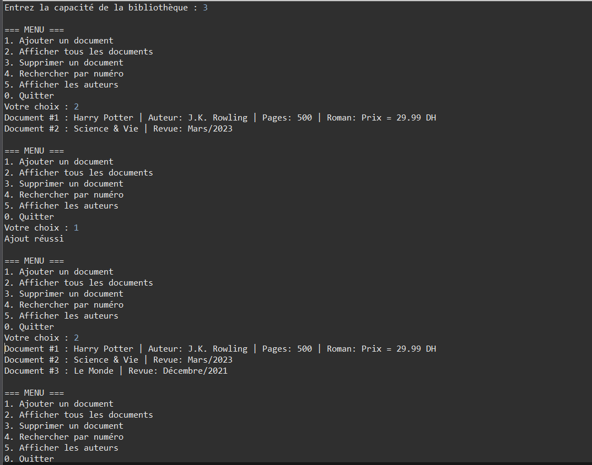

# Exercise 4: Library Management System



## Objective
Develop a comprehensive library management system with a document hierarchy, demonstrating inheritance, encapsulation, and interactive menu-driven operations.

## Description
This exercise creates a complete library system with multiple document types (books, journals, dictionaries, novels, manuals) organized in a hierarchy. The system includes full CRUD operations through an interactive console interface.

## Package Structure

```
src/
├─ entities/
│   ├─ Document.java          (Base class)
│   ├─ Livre.java             (Book)
│   ├─ Revue.java             (Journal/Magazine)
│   ├─ Dictionnaire.java      (Dictionary - extends Livre)
│   ├─ Roman.java             (Novel - extends Livre)
│   ├─ Manuel.java            (Manual/Textbook - extends Livre)
│   └─ Bibliotheque.java      (Library container)
└─ test/
    └─ Main.java              (Interactive test program)
```

## Class Hierarchy

```
                    Document (abstract/base)
                    ├─ numEnreg : int (auto-increment)
                    ├─ titre : String
                    ├─ toString()
                          /|\
                           |
              +------------+------------+
              |                         |
           Livre                     Revue
           ├─ auteur                 ├─ numero
           ├─ nbPages                ├─ mois
           ├─ toString()             ├─ annee
                |                    └─ toString()
      +---------+---------+
      |         |         |
 Dictionnaire  Roman   Manuel
 ├─ langue     ├─genre  ├─ niveau
 └─toString()  └─...    └─ ...
```

## Class Details

### Document (Base Class)
Located in `entities` package

**Attributes:**
- `numEnreg` (int): Auto-incremented registration number (starts at 1)
- `titre` (String): Document title

**Requirements:**
- Proper encapsulation (private attributes, public getters/setters)
- Auto-increment `numEnreg` using static counter
- Override `toString()` for readable display

### Livre (Book)

**Attributes:**
- Inherits from Document
- `auteur` (String): Author name
- `nbPages` (int): Number of pages

**Methods:**
- Constructor with parameters
- Getters/setters for all attributes
- Overridden `toString()`

### Revue (Journal/Magazine)

**Attributes:**
- Inherits from Document
- `numero` (int): Issue number
- `mois` (int): Month (1-12)
- `annee` (int): Year

**Methods:**
- Constructor with parameters
- Getters/setters for all attributes
- Overridden `toString()`

### Dictionnaire (Dictionary)

**Attributes:**
- Extends Livre
- `langue` (String): Language (e.g., "Français-Anglais")

### Roman (Novel)

**Attributes:**
- Extends Livre
- `genre` (String): Genre (e.g., "Science-Fiction", "Romance")

### Manuel (Manual/Textbook)

**Attributes:**
- Extends Livre
- `niveau` (String): Education level (e.g., "Universitaire", "Lycée")

### Bibliotheque (Library)

**Attributes:**
- `documents` (Document[]): Array of documents
- `capacite` (int): Maximum capacity
- `nbDocuments` (int): Current document count

**Constructor:**
```java
public Bibliotheque(int capacite)
```
Creates library with specified capacity.

**Methods:**

#### void afficherDocuments()
Displays all documents in the library with their details.

#### boolean ajouter(Document doc)
Adds document to library.
- Returns `true` if successful
- Returns `false` if library is full

#### boolean supprimer(Document doc)
Removes document from library.
- Returns `true` if found and removed
- Returns `false` if not found
- Shifts remaining documents to fill gap

#### Document document(int numEnrg)
Searches for document by registration number.
- Returns Document if found
- Returns `null` if not found

#### void afficherAuteurs()
Displays list of all authors.
- Only shows authors from Livre-derived documents
- Uses `instanceof` to check type
- Casts to Livre to access author attribute

## Interactive Menu System

The Main class provides an interactive console menu:

```
===== MENU BIBLIOTHEQUE =====
1. Ajouter un document
2. Afficher tous les documents
3. Supprimer un document
4. Rechercher un document
5. Afficher tous les auteurs
6. Quitter
============================
Votre choix :
```

### Menu Operations

1. **Ajouter** - Prompts for document type and details
2. **Afficher** - Lists all documents with details
3. **Supprimer** - Removes by registration number
4. **Rechercher** - Finds by registration number
5. **Auteurs** - Lists all unique authors
6. **Quitter** - Exits program

## Implementation Requirements

### Encapsulation
- All attributes must be private
- Public getters/setters for controlled access
- Constructor initializes all required fields

### Auto-increment Pattern
```java
private static int compteur = 0;
private final int numEnreg;

public Document(String titre) {
    this.numEnreg = ++compteur;
    this.titre = titre;
}
```

### toString() Override
Each class must provide meaningful string representation:
```java
@Override
public String toString() {
    return "Livre[numEnreg=" + numEnreg +
           ", titre='" + titre + "'" +
           ", auteur='" + auteur + "'" +
           ", pages=" + nbPages + "]";
}
```

## Example Usage

```java
// Create library with capacity of 10
Bibliotheque biblio = new Bibliotheque(10);

// Add initial documents
Document d1 = new Roman("Les Misérables", "Victor Hugo", 1500, "Classique");
Document d2 = new Dictionnaire("Larousse", "Collectif", 2000, "Français-Anglais");
Document d3 = new Revue("Science et Vie", 423, 6, 2024);

biblio.ajouter(d1);
biblio.ajouter(d2);
biblio.ajouter(d3);

// Display all
biblio.afficherDocuments();

// Search by number
Document found = biblio.document(2);
if (found != null) {
    System.out.println("Trouvé: " + found);
}

// Display authors
biblio.afficherAuteurs();

// Remove document
biblio.supprimer(d3);
```

## Expected Output Pattern

```
===== BIBLIOTHEQUE =====
[1] Roman[numEnreg=1, titre='Les Misérables', auteur='Victor Hugo', pages=1500, genre='Classique']
[2] Dictionnaire[numEnreg=2, titre='Larousse', auteur='Collectif', pages=2000, langue='Français-Anglais']
[3] Revue[numEnreg=3, titre='Science et Vie', numero=423, mois=6, annee=2024]

===== AUTEURS =====
- Victor Hugo
- Collectif
```

## Compilation & Execution

```bash
# From src/ directory
javac entities/*.java test/*.java
java test.Main
```

## Key Concepts Demonstrated

### Multi-Level Inheritance
- Document → Livre → Dictionnaire/Roman/Manuel
- Document → Revue
- Three levels of hierarchy

### Encapsulation
- Private attributes
- Public accessors
- Controlled data access

### Polymorphism
- Array of Document holds all types
- Correct toString() called for each type
- `instanceof` for type checking

### Array Management
- Fixed capacity library
- Add/remove operations
- Search functionality
- Array shifting for deletions

### Type Checking and Casting
```java
if (documents[i] instanceof Livre) {
    Livre livre = (Livre) documents[i];
    System.out.println(livre.getAuteur());
}
```

## Verification Checklist
- [ ] Auto-increment works for all document types
- [ ] Library respects capacity limit
- [ ] Add operation returns false when full
- [ ] Remove operation shifts array correctly
- [ ] Search finds documents by number
- [ ] afficherAuteurs() shows only book authors
- [ ] All toString() methods work correctly
- [ ] Menu system handles all operations
- [ ] Input validation prevents errors

## Possible Extensions

### Enhanced Features
- **ISBN Management**: Add ISBN for books
- **Due Dates**: Track borrowed documents
- **User System**: Library cards and borrowing history
- **Reservation System**: Queue for popular documents
- **Categories**: Tag-based classification

### Search Enhancements
- Search by title (partial match)
- Search by author
- Search by year/date range
- Filter by document type

### Reporting
- Most borrowed documents
- Overdue reports
- Collection statistics
- Acquisition reports

### Data Persistence
- Save library to file (serialization)
- Load library from file
- Export to CSV/JSON
- Database integration

### GUI Development
- JavaFX interface
- Swing desktop application
- Web interface

## Files
- `entities/Document.java`: Base document class
- `entities/Livre.java`: Book class
- `entities/Revue.java`: Journal class
- `entities/Dictionnaire.java`: Dictionary (extends Livre)
- `entities/Roman.java`: Novel (extends Livre)
- `entities/Manuel.java`: Manual (extends Livre)
- `entities/Bibliotheque.java`: Library management
- `test/Main.java`: Interactive menu system
- `subejct.txt`: Complete exercise specifications
